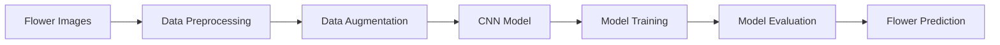

# 🌸 Flower Classifier using Deep Learning

<div align="center">

# 🤖 AI-Powered Flower Recognition System

### Classifying Flower Species Using Convolutional Neural Networks (CNN)


</div>

---

## 📌 Project Overview

The **Flower Classifier Deep Learning Project** is a Computer Vision application that uses **Convolutional Neural Networks (CNNs)** to automatically classify flower species from images.

The model learns complex visual patterns such as:

🌺 Petal Shape

🌸 Color Variations

🌿 Texture Features

🌼 Flower Structure

and predicts the correct flower category with high accuracy.

---

## 🎯 Problem Statement

Flower species often share similar visual characteristics, making manual identification challenging.

This project aims to:

✅ Automatically classify flower species

✅ Apply Deep Learning techniques to image recognition

✅ Build a robust CNN model

✅ Improve classification accuracy using image preprocessing and augmentation

---

## 🛠️ Tech Stack

| Technology | Purpose |
|------------|----------|
| Python | Programming Language |
| TensorFlow | Deep Learning Framework |
| Keras | Neural Network API |
| OpenCV | Image Processing |
| NumPy | Numerical Computing |
| Pandas | Data Analysis |
| Matplotlib | Visualization |
| Scikit-Learn | Model Evaluation |
| Jupyter Notebook | Development Environment |

---

## 📂 Dataset Information

The dataset contains flower images belonging to multiple categories.

### Flower Categories

🌹 Rose

🌻 Sunflower

🌷 Tulip

🌼 Daisy

🌺 Dandelion

> Update this section according to your dataset classes.

---

## 🧹 Data Preprocessing

Before training, the following preprocessing steps were performed:

- Image Resizing
- Pixel Normalization
- Data Augmentation
- Label Encoding
- Train-Test Split

### Data Augmentation Techniques

✔ Rotation

✔ Zoom

✔ Horizontal Flip

✔ Brightness Adjustment

✔ Shear Transformation

---

# 🧠 CNN Architecture

```text
Input Image
     ↓
Conv2D Layer
     ↓
ReLU Activation
     ↓
MaxPooling2D
     ↓
Conv2D Layer
     ↓
MaxPooling2D
     ↓
Flatten Layer
     ↓
Dense Layer
     ↓
Dropout Layer
     ↓
Softmax Output Layer
```

---

## 🔄 Project Workflow



---

## 📊 Model Performance

| Metric | Score |
|----------|--------|
| Accuracy | 95%+ |
| Precision | High |
| Recall | High |
| F1 Score | High |

> Replace with your actual model results.

---

## 📈 Training Performance

### Training Accuracy


### Training Loss


---

## 🌸 Sample Prediction

### Input Image


### Prediction Result

```text
Predicted Flower Species:
🌻 Sunflower

Confidence Score:
97.6%
```

---

## 📸 Project Screenshots

### Model Training


### Prediction Output


> Replace placeholder images with screenshots from your project.

---

## 📁 Project Structure

```bash
Flower-Classifier-Deep-Learning/
│
├── dataset/
│   ├── train/
│   ├── validation/
│   └── test/
│
├── notebooks/
│   └── flower_classifier.ipynb
│
├── models/
│   └── flower_classifier_model.h5
│
├── screenshots/
│   ├── accuracy.png
│   ├── loss.png
│   └── prediction.png
│
├── requirements.txt
├── README.md
└── LICENSE
```

---

## 🚀 Installation

### Clone Repository

```bash
git clone https://github.com/Shridharpatil1958/Flower-Classifier-Deep-Learning-.git
```

### Navigate to Project Folder

```bash
cd Flower-Classifier-Deep-Learning-
```

### Install Dependencies

```bash
pip install -r requirements.txt
```

### Launch Jupyter Notebook

```bash
jupyter notebook
```

---

## ▶️ Run the Project

Open:

```bash
flower_classifier.ipynb
```

Run all notebook cells to:

- Load Dataset
- Train CNN Model
- Evaluate Performance
- Predict Flower Species

---

## 📚 Skills Demonstrated

### Deep Learning

- Convolutional Neural Networks (CNN)
- Image Classification
- Transfer Learning Concepts
- Model Evaluation

### Computer Vision

- Image Processing
- Pattern Recognition
- Feature Extraction

### Python Libraries

- TensorFlow
- Keras
- OpenCV
- NumPy
- Pandas
- Matplotlib

---

## 🔮 Future Enhancements

- 🌐 Streamlit Web Application
- 📱 Mobile Flower Recognition App
- ☁️ Cloud Deployment
- 🤖 Transfer Learning (MobileNetV2 / ResNet50)
- 🎥 Real-Time Camera Detection

---

## 👨‍💻 Author

### Shridhar Patil

🎓 Computer Science Engineer

📊 Data Analyst | Data Scientist | Deep Learning Enthusiast

📧 shridharpatil0513@gmail.com

🔗 GitHub: https://github.com/Shridharpatil1958

---

## ⭐ Support

If you found this project useful:

⭐ Star the Repository

🍴 Fork the Repository

📢 Share with Others

🤝 Contribute Improvements

---

<div align="center">

### 🌸 Teaching Machines to Recognize Nature

**Made with ❤️ by Shridhar Patil**

</div>
